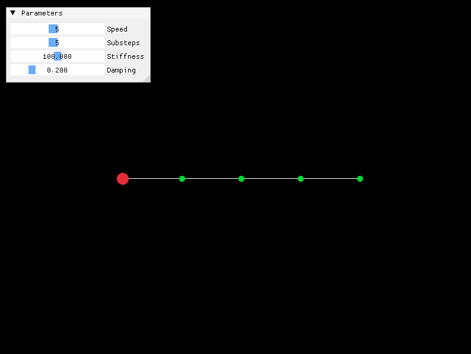
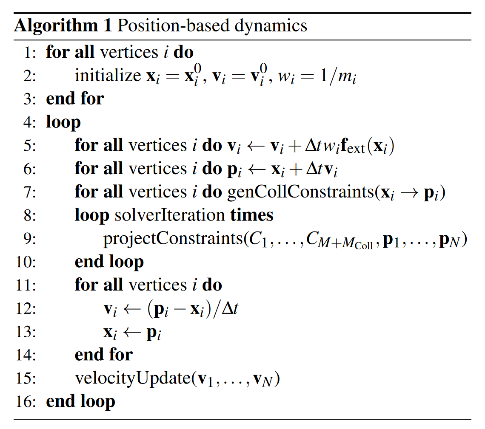
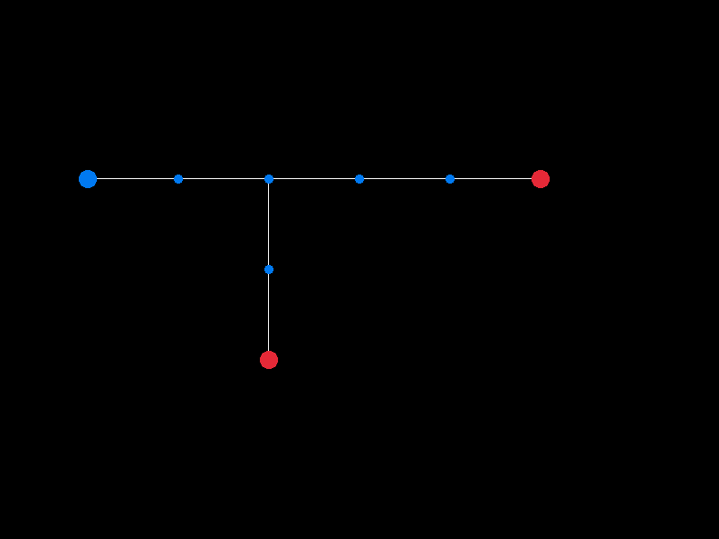

# CG (Computer Graphics)

## Introduction

This is a collection of my computer graphics related implementations. Including physics simulation (PhySim), software renderer (Renderer) and some math (Math).

## Compile

This project is built with MinGW under window. All the dependencies have been contained as submodule in the `external` folder, so add the `--recursive` flag when cloning the repository.

The dependencies are listed as follows:

1. raylib: simple visualization
2. eigen3: vector math
3. raygui: gui components
4. rlimgui(imgui): same as raygui

It is recommended to download MinGW from [w64devkit](https://github.com/skeeto/w64devkit). To compile the project, [cmake](https://cmake.org/) is also required.

```cmd
git clone --recursive https://github.com/lovoski/CG.git
cd CG
mkdir build
cd build
cmake ..
make
```

## Implement Details

### Physics Simulation

The learning resources includes [Fluid Simulation for Computer Graphics](https://www.cs.ubc.ca/~rbridson/fluidsimulation/) by Robert Bridson.

[Position-Based Simulation Methods in Computer Graphics](https://mmacklin.com/EG2015PBD.pdf) by Jan Bender.

All the simulators are present as simple 2d form, so that i can understand the concepts of these methods and then implement a 3d version with unity.

There are some simulators I think worth mentioning.

The first one is a damping spring simulator based on PBD method.
In the demo, the red point is the start point of the system, the green points are the expected rest positions of correponding blue points, if the blue point has a different position with the green point, a damped spring force will be applied to the very blue point. One simulation during one frame consists of multiple substeps. To help accelerate the animation, a constant `speed` is multiplied to `dt` in each frame.



PBD is an intuitive method to simulate simple phenomenon. During the simulation, the object is considered as a set of particles each with its own position and velocity. Our job is to update the velocity with some specific velocity-updating rule. Then integrate the velocity with time to get the delta amount of position. The pipeline of PBD can be represented as follows.



### Inverse Kinematics Solvers

The learning resource includes [FABRIK](http://www.andreasaristidou.com/FABRIK.html) by Andreas Aristidou.

FABRIK is an exemplary heuristic iterative inverse kinematics solver, surpassing other existing solvers in terms of its remarkable simplicity and unparalleled flexibility.

In this repository, a simple multi-target solver is implemented in 2d.



### Spring Damper

The learning resource is [Spring It On](https://theorangeduck.com/page/spring-roll-call#springdamper) by Holden which gave a detailed explaination to the equations used to construct a simple damper, an exact damper, and some spring dampers.

It is noteworthy that solving an exact spring damper involves solving an ordinary differential equation (ODE) with the following structure:

$$
\frac{\partial^2x}{\partial t^2}=stiffness\times (x_g-x) + damping\times (v_g-\frac{\partial x}{\partial t})
$$

Holden gave an analytic solution for this ODE under three conditions named cirtical damped, under damped and over damped.

To make a controller based on the damper, we would put the user input as 2d vector indicating the desired velocity for the player in current frame, and use a spring damper to approximate the desired speed. The positions is itegrate direction from the analytic solution of velocity.

I wrote a simple demo of it : 


### Rasterize Renderer

The learning resource includes [tinyrenderer](https://github.com/ssloy/tinyrenderer) by ssloy, [games101](https://sites.cs.ucsb.edu/~lingqi/teaching/games101.html) by [Lingqi Yan](https://sites.cs.ucsb.edu/~lingqi/index.html).

### Path Tracer

The learning resource includes [RayTracingInOneWeekend](https://raytracing.github.io/books/RayTracingInOneWeekend.html) by Shirley et al.

### Data Structure

A simple halfedge mesh data structure from scratch is included in `DS/Halfedge.h`:

```cpp
CG::HalfedgeMesh mesh(RESOURCE_DIR "/cloth.off");

int vn = mesh.GetNumVertices();
int vf = mesh.GetNumFaces();
int ve = mesh.GetNumHalfedges();

PrintEdgeInfo(mesh, mesh.Next(e1));
PrintEdgeInfo(mesh, mesh.Next(mesh.Next(e1)));

auto neigh = mesh.NeighborsOfVertex(0);
```
